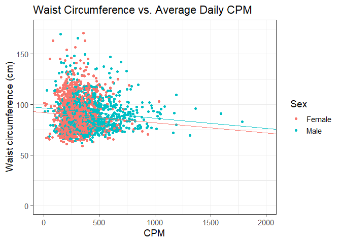

Process Accelerometer Data from NHANES 2003-2006
================
Dane Van Domelen <br> <vandomed@gmail.com>
2020-07-30

<!-- README.md is generated from README.Rmd. Please edit that file -->

[](https://travis-ci.org/vandomed/nhanesaccel)

## Introduction

The National Health and Nutrition Examination Survey (NHANES) included
physical activity monitoring to their 2003-2004 and 2005-2006 study
cycles. Altogether, almost 15,000 participants age \(\ge\) 6 years wore
an ActiGraph accelerometer at the hip for 7 consecutive days. The data
are freely available to download from the [NHANES
website](https://wwwn.cdc.gov/nchs/nhanes/continuousnhanes/default.aspx?BeginYear=2003).
You don’t have to submit a proposal, you don’t have to find a study
investigator to ~~leach authorship~~ help you understand the data, none
of that. I think the CDC deserves a lot of credit for this setup.

The raw accelerometer data needs to be processed to generate meaningful
physical activity varaibles, and indeed a SAS script was provided by the
National Cancer Institute for this purpose (National Cancer Institute
2007). But it only calculates a few variables, it isn’t easily
modifiable, and it takes a long time to run. So I developed
**nhanesaccel** to process the data in R much faster and with more
options.

## Install

The package includes the raw data and functions for processing it. It’s
way too big for CRAN because of the raw data, so it’s only on GitHub. To
install it, you can run:

``` r
library("devtools")
install_github("vandomed/nhanesaccel")
```

If this doesn’t work, you might try installing **accelerometry** (Van
Domelen 2018a) from CRAN first with `install.packages("accelerometry")`.
If you still have problems, e-mail me at <vandomed@gmail.com> and I can
try to help.

## Usage

#### Defaults

The primary function in **nhanesaccel** is *process\_nhanes*. If you
call it without specifying anything, it will process the 2003-2006 data
with default data-processing parameters (i.e. my personal preferences).

``` r
df <- process_nhanes()
#> Loading NHANES 2003-2004 data... 
#>           0-2
#> Progress: ||
#> 
#> Processing NHANES 2003-2004 data...
#>           0%---------25%---------50%---------75%--------100%
#> Progress: ||||||||||||||||||||||||||||||||||||||||||||||||||
#> 
#> Loading NHANES 2005-2006 data...
#>           0-2
#> Progress: ||
#> 
#> Processing NHANES 2005-2006 data...
#>           0%---------25%---------50%---------75%--------100%
#> Progress: ||||||||||||||||||||||||||||||||||||||||||||||||||
#> 
#> Done.
```

As you can see from the messages, it processed data from both 2003-2004
and 2005-2006. To see what variables it generated:

``` r
names(df)
#>  [1] "seqn"          "valid_days"    "valid_wk_days" "valid_we_days"
#>  [5] "include"       "valid_min"     "counts"        "cpm"          
#>  [9] "steps"         "wtmec2yr_adj"  "wtmec4yr_adj"  "nhanes_wave"
```

I won’t go through all of them, but `seqn` is the subject ID number,
`valid_days` is the number of days out of 7 that were deemed suitable
for analysis (the subject wore the accelerometer long enough),
`valid_min` is the average number of wear time minutes per day, and
`counts` and `cpm` are two common indicators of physical activity
volume. The `wtmec2yr_adj` and `wtmec4yr_adj` variables are the adjusted
MEC weights that you’ll want to use for statistical analysis.

Let’s look at the relationship between `valid_min` and `counts` in the
full dataset.

``` r
library("ggplot2")
p <- ggplot(df, aes(x = valid_min, y = counts)) + 
  geom_point() + 
  xlim(0, 1440) + ylim(0, 1750000) + 
  geom_smooth(method = "lm") + 
  labs(title = "Counts vs. Wear Time", x = "Wear time (min/day)", y = "Counts/day") + 
  theme_bw(base_size = 14)
p
#> Warning: Removed 1841 rows containing non-finite values (stat_smooth).
#> Warning: Removed 1841 rows containing missing values (geom_point).
```

<!-- -->

Notice that `valid_min` ranges from 600 to 1440. The lower bound is due
to the default requirement that only days with 600 minutes (10 hours) of
wear time be included, and the upper bound, 1440, is the number of
minutes in 24 hours. The fact that some subjects average 1440 minutes of
wear time means either they didn’t sleep (not likely\!) or maybe forgot
to remove the device before bed and had small movements while sleeping.

It looks like counts ranged from about 0 all the way up to around 1.5
million, which is very high but plausible considering that roughly
10,000 counts per minute can be achieved during intense physical
activity.

As you would expect, participants who wore the device longer tended to
accumulate more counts. That’s why we typically adjust for wear time
when fitting regression models with accelerometer-derived variables.

#### Mimicking the NCI’s SAS programs

I figured a lot of users would want to replicate the NCI’s SAS programs,
so I wrote *process\_nhanes* to allow for that. Rather than specifying
about 30 separate inputs, you can simply use the `nci_methods` input as
a shortcut. To illustrate with just the 2003-2004 data:

``` r
df.0304 <- process_nhanes(waves = 1, nci_methods = TRUE)
#> Loading NHANES 2003-2004 data... 
#>           0-2
#> Progress: ||
#> 
#> Processing NHANES 2003-2004 data...
#>           0%---------25%---------50%---------75%--------100%
#> Progress: ||||||||||||||||||||||||||||||||||||||||||||||||||
#> 
#> Done.
```

Obviously I don’t fully agree with the NCI’s methods (otherwise they
would be the defaults\!), but a lot of it is subjective. One thing I
don’t like is that they use a really liberal algorithm for non-wear
detection, which I suspect tends to misclassify sedentary time as
non-wear.

#### More variables, different settings

You can read about all of the different options in the help file (run
`?process_nhanes`), but I’ll give one example of adjusting the default
parameters. To process the 2003-2004 data with a 45-minute non-wear
algorithm, requiring at least 4 valid days of data, and requesting a
bunch of variables, you could run:

``` r
df2 <- process_nhanes(waves = 1, nonwear_window = 45, valid_days = 4, brevity = 3)
#> Loading NHANES 2003-2004 data... 
#>           0-2
#> Progress: ||
#> 
#> Processing NHANES 2003-2004 data...
#>           0%---------25%---------50%---------75%--------100%
#> Progress: ||||||||||||||||||||||||||||||||||||||||||||||||||
#> 
#> Done.
```

#### Per-person vs. per-day data

The default behavior of *process\_nhanes* is to return a per-person file
with physical activity variables averaged across all valid days for each
subject. If you want a per-day file instead, in long format, you can set
`return_form = "daily"` rather than the default `return_form =
"averages"`. For a list containing both datasets, you can set
`return_form = "both"`.

## Merging other datasets and fitting models

This is a little beyond the scope of the README, but I would suggest my
**nhanesdata** package (Van Domelen 2018b) for accessing the other
NHANES datasets and **survey** (Lumley 2017, 2004) for fitting models
while accounting for the survey design of NHANES. You can install
**nhanesdata** with `install_github("vandomed/nhanesdata")` and
**survey** with `install.packages("survey")`.

Here is a simple example of merging in two datasets (demographics and
body measures) to our first `df` dataset and fitting a model for waist
circumference vs. sex and average daily CPM in adults age 18-29.

``` r
# Load packages
library("nhanesdata")
library("survey")
library("dplyr")

# Merge in demographics and body measures datasets and recode sex
names(df) <- toupper(names(df))
df <- df %>% 
  dplyr::left_join(full_join(demo_c, demo_d)) %>%
  dplyr::left_join(full_join(bmx_c, bmx_d)) %>%
  dplyr::mutate(sex = factor(RIAGENDR, levels = c(2, 1), labels = c("Female", "Male")))

# Specify survey design object
design <- svydesign(
  data = subset(df, INCLUDE == 1),
  ids = ~SDMVPSU, 
  weights = ~WTMEC4YR_ADJ, 
  strata = ~SDMVSTRA, 
  nest = TRUE
)

# Fit waist circumference vs. sex and average CPM
fit <- svyglm(BMXWAIST ~ sex + CPM, 
              design = subset(design, RIDAGEYR %in% 18: 29 & ! is.na(BMXWAIST)))
summary(fit)$coef
#>                Estimate  Std. Error   t value     Pr(>|t|)
#> (Intercept) 92.02352580 1.133406436 81.191992 8.778405e-35
#> sexMale      4.43712733 0.921831675  4.813381 4.619544e-05
#> CPM         -0.01000123 0.002534363 -3.946250 4.852598e-04
```

We see that males average 4.44 cm larger waists than females, and CPM
(our measure of physical activity volume) is inversely associated with
waist circumference, as expected. Note that the slopes for males and
females were not statistically different (interaction P = 0.67).

Here is a scatterplot to go along with the fitted model:

``` r
p <- ggplot(subset(df, RIDAGEYR %in% 18: 29), 
            aes(x = CPM, y = BMXWAIST, color = sex)) + 
  geom_point() + guides(color = guide_legend(title = "Sex")) + 
  ylim(0, 175) + 
  geom_abline(intercept = fit$coef[1], slope = fit$coef[3], color = "#F8766D") +
  geom_abline(intercept = fit$coef[1] + fit$coef[2], slope = fit$coef[3], color = "#00BFC4") + 
  labs(title = "Waist Circumference vs. Average Daily CPM", 
       x = "CPM", y = "Waist circumference (cm)") + 
  theme_bw(base_size = 14)
p
#> Warning: Removed 522 rows containing missing values (geom_point).
```

<!-- -->

## Shiny app

Part of my motivation for developing **nhanesaccel** was to allow
researchers without a SAS license (or knowledge of SAS) to process the
data. But what about people who don’t use R either?

I decided to convert *process\_nhanes* into a Shiny app, so that users
could just visit a website, select various options within a GUI, and
ultimately process the data and export an analysis file.

I’ve written the app, but it isn’t online yet. For now, you have to
launch it from R by running:

``` r
process_nhanes_app()
```

## References

<div id="refs" class="references">

<div id="ref-survey2">

Lumley, T. 2004. “Analysis of Complex Survey Samples.” *Journal of
Statistical Software* 9 (1): 1–19.
<http://www.jstatsoft.org/v09/a08/paper>.

</div>

<div id="ref-survey1">

———. 2017. *survey: Analysis of complex survey samples*.
<http://CRAN.R-project.org/package=survey>.

</div>

<div id="ref-ncisas">

National Cancer Institute. 2007. “SAS programs for analyzing NHANES
2003-2004 accelerometer data.”
<http://riskfactor.cancer.gov/tools/nhanes_pam>.

</div>

<div id="ref-accelerometry">

Van Domelen, Dane R. 2018a. *accelerometry: Functions for processing
accelerometer data*.

</div>

<div id="ref-nhanesdata">

———. 2018b. *nhanesdata: Data from continuous NHANES (Years 1999-2016)*.

</div>

</div>
